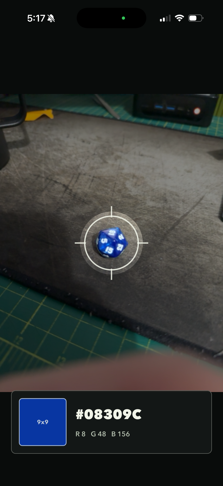

# Eye Inspector

Eye Inspector is a Flutter app for sampling colors from the real world and from the desktop.

On iOS and Android, it uses the camera stream to inspect the averaged color under a center cursor. On macOS, Windows, and Linux, it provides a desktop color bench with an eyedropper, saved swatches, and named color sets.

<p align="center">
  
</p>

## Features

- Camera color inspection on iOS and Android.
- Averaged 9x9 center sampling to reduce camera noise.
- Live hex and RGB readout.
- Desktop color picker on macOS, Windows, and Linux.
- Saved swatches persisted locally.
- Named color sets built from saved swatches.

## Requirements

- Flutter 3.44.0 or newer.
- Xcode for iOS and macOS builds.
- Android SDK for Android builds.
- Linux desktop builds require GTK and X11 development libraries.
- Windows desktop builds require Visual Studio with C++ desktop tooling.

## Run

Install dependencies:

```sh
flutter pub get
```

Run on a connected device or desktop target:

```sh
flutter run
```

Run on macOS specifically:

```sh
flutter run -d macos
```

## Test

Run static analysis:

```sh
flutter analyze
```

Run unit tests:

```sh
flutter test
```

Build macOS debug:

```sh
flutter build macos --debug
```

Build iOS without signing:

```sh
flutter build ios --release --no-codesign
```

## TestFlight

The iOS bundle id is:

```text
com.vaporeyes.eyeInspector
```

Create the matching app record in App Store Connect, then build an IPA:

```sh
flutter build ipa --release --build-name 1.0.0 --build-number 1
```

Upload the archive with Xcode Organizer or Transporter, then add testers in App Store Connect under TestFlight.

## Platform Notes

- macOS uses the native system color sampler plus live cursor sampling.
- Windows samples the screen pixel under the global cursor.
- Linux samples the screen pixel under the global cursor on X11. Wayland may block global screen pixel access.
- iOS requires camera permission. The camera usage string is configured in `ios/Runner/Info.plist`.
